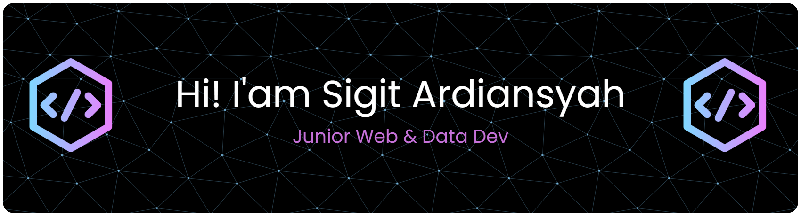

---

## 🌐 Socials

---

## 💻 Tech Stack

### 🐍 Python

### 🗄️ Databases

### 📊 BI / Visualization

### 🌐 Web

### ⚙️ JS/TS & WhatsApp Automation

### 🧰 Tools

---

## 📊 GitHub Stats

  
   

   

  
  

  

  

---

